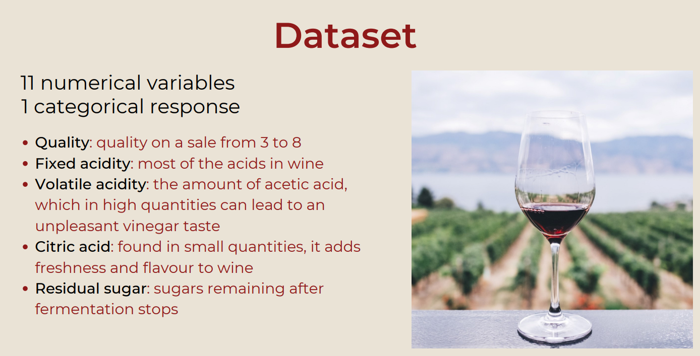
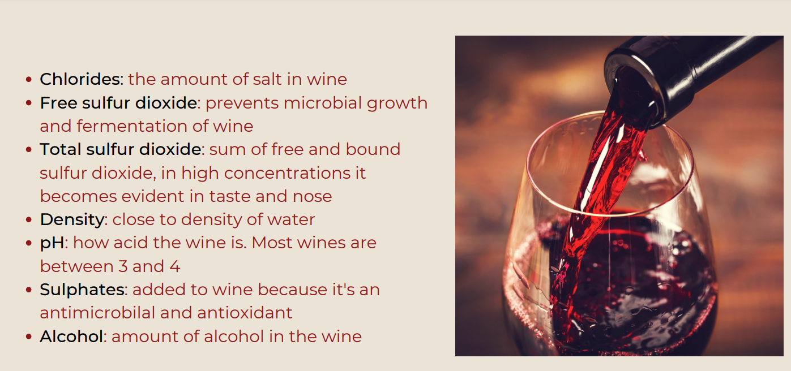

### :wine_glass: Red wine Quality Analysis
:warning:   Please note: The R code attached is not well defined nor ordered. The reason is that the exam required only a Canva presentation, so we used R only to obtain the result we need.

This project was carried out by me together with 3 of my classmates as part of the **Applied Linear Models** course. The goal of our analysis has been to determine which physiochemical properties most influence wine quality and to what extent.

**Note**: The dataset is probably one of the most known in data science field, however throughout the duration of the project we never went to see projects done by other people or pages that talked about this dataset, so as to make the project as realistic as possible.

## Introduction

To perform our analysis we have used two models: the multinomial model and the binomial model. After a model selection and diagnostic, they lead to similar results. In both our models we will find that the same variables are useful to explain the response variable.

The popular dataset is a collection of 1599 observations, which is easily found on [kaggle](https://www.kaggle.com/datasets/uciml/red-wine-quality-cortez-et-al-2009), there are 10 physiochemical properties that are commonly taken into consideration to determine how good a wine is.

  
   

## Exploratory Data Analysis

### Boxplots 

Here there are some boxplots: after an initial analysis, some variable seemed more influential.The last one instead is a variable that doesn’t seem to explain the quality significantly.

  
  

  
  

### Correlation Matrix

As you can see there seems to be some positive and negative correlations that we need to investigate ( between pH and fixed acidity, and positive correlation between total sulphur dioxide and free sulphur dioxide, fixed acidity and citric acid, fixed acidity and density). From a scientific point of view we could expect these results: the pH measures the acidity on a logarithmic scale so a variation in the levels of acids will necessarily have an impact on the pH. Furthermore the total sulphur dioxide is the sum of free and bound sulphur dioxide so the correlation is easily explained. (Finally, citric acid is usually considered to be part of the fixed acidity. 

### Variance Inflation Factor (VIF)
To help our analysis we also checked the VIF. We noticed that for two variables it’s particularly high: density and fixed acidity are above the threshold level of 5, so we definitely need to investigate those.

### The Fixed Acidity situation

Yes, the title of this part is definitely inspired to Pulp Fiction, if you're asking yourself. But let's move to serious thing.
As said above, the fixed acidity needed to be investigated, since the Variance Inflation Factor of this variable is pretty high, meaning that probably it is highly related to other explanatory variables in the dataframe.
To analyze further, we regressed it against the other variables. We observed a particularly high $R^2$(0.87). This means that with all the others observations we can explain the 87% of the variance of fixed acidity.

We tried to re-calculate the VIFs without including the fixed acidity. The VIFs of all the variables are now all acceptable so we have reason to believe fixed acidity needs to be eliminated.We may still have a problem with total and and free sulphur dioxide. We relied on scientific knowledge to assume we needed to eliminate the total sulphur dioxide and replaced it with the bound sulphur dioxide, which wasn’t one of our initial variables.

Here let me show the new VIF plot and the new correlation matrix:

  
   

The correlation matrix with these adjustments looks more acceptable now. 

Now that the exploratory analysis is complete, we can start by analyzing the two models.

## Multinomial Model

### Splitting the quality

We have an ordered categorical variable so the natural choice is to start our analysis with a multinomial model.
First of all we divided the response variable in three levels: bad for grades 3, 4 and 5, medium for grades 6, and good for grades 7 and 8.
We can note that each level is well represented:

### Mathematical Aspects

With this model our goal is to find the probability, for each observation, that the response belongs to each of the three categories.
In this model it’s easier to work with cumulative probability. Since the cumulative distribution function assumes values between 0 and 1, we need to use a link 
function to model it. We used the proportional odds link function (which is the default one in R).

- Cumulative probabilities: $$\gamma_{ij}=P(Y_i \leq j)$$
- General form of the link function: $$g(Y_{ij})=\theta_j-\beta^T x_i$$
- Log-odds function: $$log(\frac{\gamma_{ij}}{1-\gamma_{ij}})$$

### Final Model

Here we show the model we reached through our analysis. 
To prove our results we need a p-value, but this test doesn’t provide one. (One way to calculate a p-value in this case is by comparing the t-value against the standard normal distribution, like a z-test. Of course this is only true with infinite degrees of freedom, but is reasonably approximated by large samples, becoming increasingly biased as sample size decreases.) The results show that all of our remaining variables are significant.

### Model Selection

To get to this result we used different model selection approaches, and then proceeded to compare them:

#### Criterion-based test: AIC
The first tool we used was the Akaike information criterion. As you can see on this graph, it suggests that the model which minimises the AIC is the one with these 7 variables. Next to the plot, there is the summary of model which includes the 7 variables suggested by the previous test:

  
  

#### Criterion-based test: BIC
Then we used the Bayesian information criterion. As we could expect it suggests a model with less variables (6 variables), because we know it penalises the number of variables more than the AIC. The summary of the model is the same, but in this case Residual Sugar was excluded.

#### Testing-based procedures: Single term deletion with "Chi Square" test
Lastly we carried out a backward elimination based on the Chi-squared test of likelihood ratio. It shows the variables we should include in the best model, which once again is 6. The model suggested is actually the same the BIC suggested.

  

#### Comparison with the full model: ANOVA with $X^2$ test

Given these results, we decided to compare the 6-variable and 7-variable models. We compare the 6-variable model with the full model and we see that we fail to reject the null hypothesis. This means we have statistical evidence to assume all the parameters we removed are equal to 0.

  

### Model diagnostic

We then start with the model diagnostic. 
The **Brant test** checks if the proportional odds assumption, which we need for our link function, holds in our model. It our case the general p-value and all the individual ones are above the 5% threshold so we can state that the assumption holds and we can have a single parameter for every class.

 $H_0: \beta_k=\beta$
 
 $H_1: \beta_k=\phi_k \beta$

  

With the **Hosmer-Lemeshow** test we verify the goodness of fit. We got a p-value of 0.098,so we can’t reject the null hypothesis that the model suits the data. 
We are then satisfied with our model with 6 variables.

## Binomial Model

### Splitting the quality

Next we tried to fit a binomial model. This time we divided the grades in two groups. As you can see on the plot we divided them in a fairly even way, so that both categories are well represented. Grades 3,4, and 5 were considered as "poor" and grades 6,7,8 as "good".

Our goal now is to model the probability that a wine is classified as good.
Again, we can't model directly p, so we model it though a link function which in our case is the
logit link function

### Mathematical Aspects

- Binomial distribution: $P(Y_i=y_i)=\binom{n_i}{y_i}p_i^{y_i}(1-p_i)^{n_i-y_i}$
- Logit link model: $\eta=log(\frac{p}{1-p})=\beta_0+\beta_1x_1+...+\beta_qx_q$
- Inverse of logit: $p=g^{-1}(\eta)=\frac{e^\eta}{e^\eta + 1}$

### Final Model

### Model Selection

We used AIC and BIC for model selection also in this case, and then a backward elimination

#### Criterion-based test: AIC

This test suggested 7 predictors: volatile acidity, chlorides, sulphates, alcohol, bound sulphur dioxide, citric acid, pH.

#### Criterion-based test: BIC

The BIC suggests a model with less variables, 5 in this case.

Again, the BIC suggests a model with less variables, 5 in this case.
The variables included are the same as the ones in the multinomial model, except pH which is not included. 

#### Comparison with the full model: ANOVA with $X^2$ test and Goodness of fit

We compared the model suggested by the BIC with the full model using the ANOVA with a chisquared test. It showed that, again, we can’t reject the null hypothesis (that the parameters removed are 0) so we stick with the 5-variables model.

### Model diagnostic

We proceeded to check if there is any observation that need to be investigated through the plots of the residuals. We can see there is a strange observation, the number 653, so we proceed to check if it is an outlier.

With the studentized residuals we can see that all the points are under the critical value of the tdistribution, which determines the outliers. Hence observation number 653 is not an outlier and we should’t worry about it.

#### Checking for influential observations

With the Cook’s distance we could see there weren’t any point above the critical value of the cooks distance.
We then checked though the df beta function if any observation significantly changed our coefficients. The only observation that was (frequently) far from the cloud of data was the number 755. 
We then checked the summary of the models with and without it and we found out that there
were only minor changes in all the estimates and p-values, so we decided to keep it.

## Conclusion 

Our initial goal was to determine which are the physiochemical properties that affect the quality of the wine and to what extent.
By analyising two different models we reached similar results. In both cases citric acid, free sulfur dioxide, residual sugar and density do not help us explain the quality of wine. We are left with these 5 variables, while the pH is the only variable that appears in the multinomial model but not in the binomial.
Most importantly in both models the effect of the variables have the same sign!
